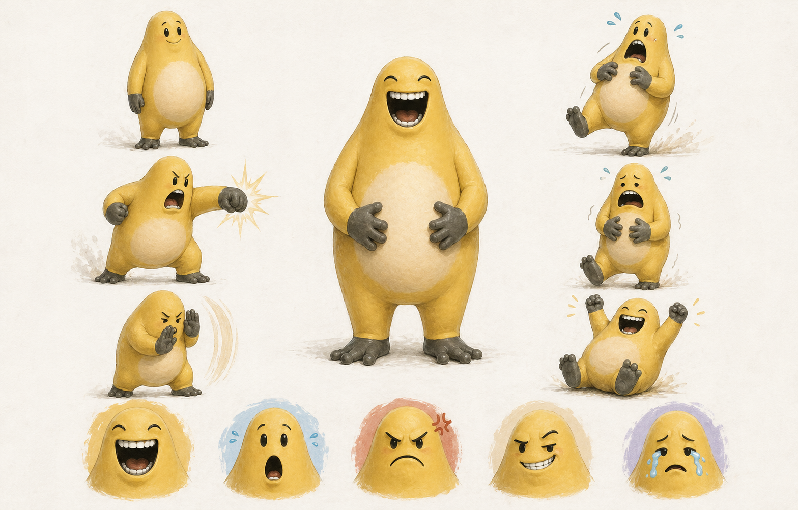
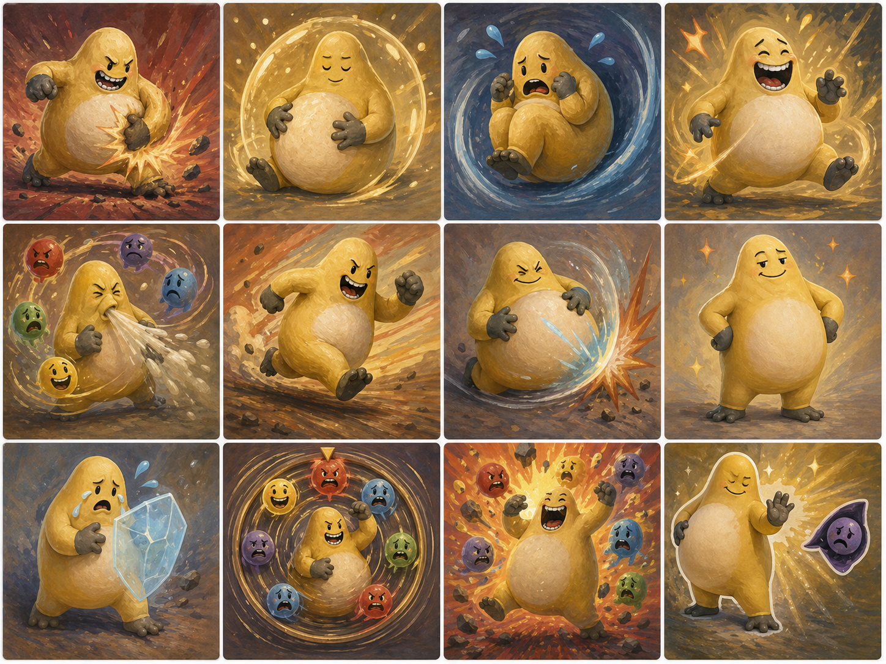
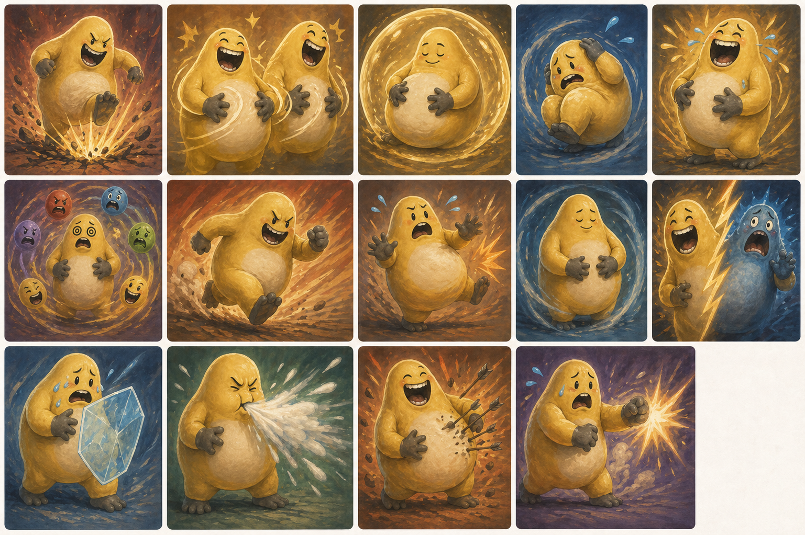
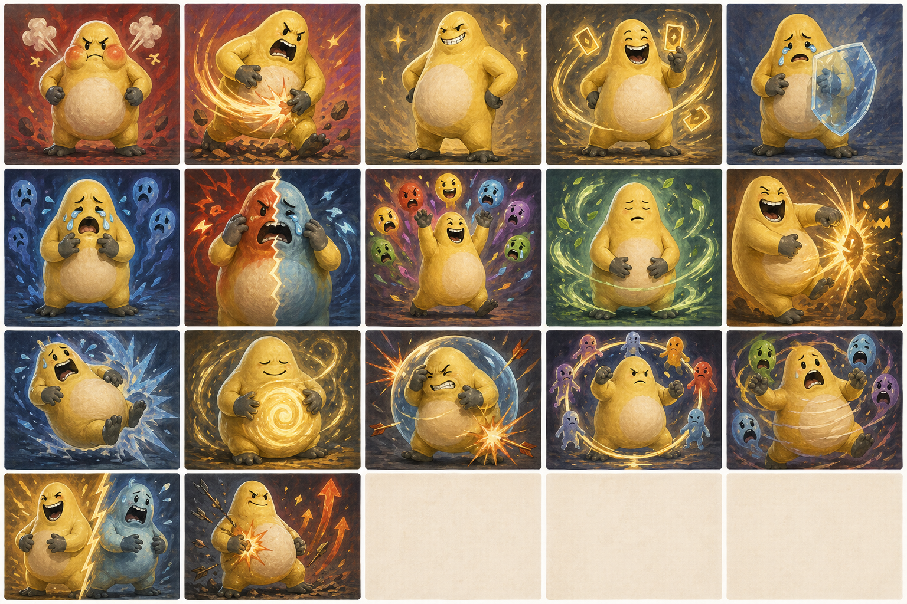
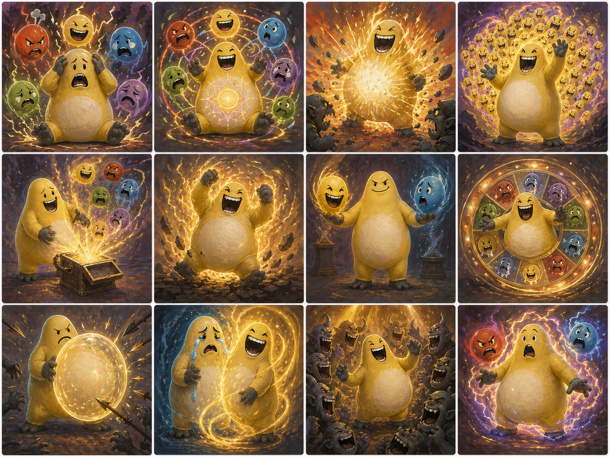
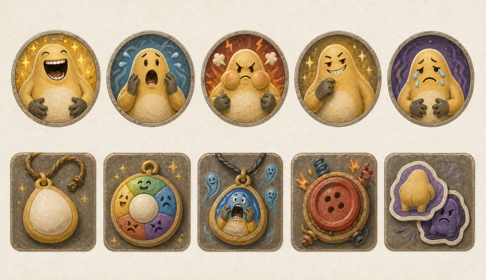

# 捧腹奶龙角色设计初稿

## 文档规则

本文件是捧腹奶龙的完整设计稿，可以超过仓库普通手写文件 400 行限制。

## 定位

捧腹奶龙是一个以“表情姿态”为核心的新角色。

角色气质偏喜剧、情绪外放、身体很耐打。战斗中不追求稳定切换姿态，而是通过带一点随机性的表情变化，制造临场取舍。

## 视觉参考

视觉关键词：

- 黄色软胖体型，腹部是最重要的视觉中心。
- 表情夸张，适合承载表情姿态机制。
- 动作气质偏搞笑、外放、反差感强。
- 灰色手脚可以作为卡面、图标和 UI 边框的辅助色。

素材说明：

- 当前图片作为角色设计参考图归档。
- 进入正式发布前，需要确认图片授权和最终游戏资源形态。
- 后续游戏内资源应从参考图拆分或重绘为角色立绘、表情图标、卡牌插画和动画素材。

设计目标：

- 让角色形象和机制一致：大笑、惊吓、委屈、生气等表情都能影响战斗。
- 每个表情都同时有正面和负面效果，避免成为纯收益姿态。
- 起始版本只开放少量表情，降低学习成本。
- 先保证规则简单，再用高稀有度卡牌和进阶遗物扩展构筑上限。

## 角色形象与卡面美术 v0.1

视觉方向采用“高一点的圆胖梨形 + 哑光手绘黏土质感”。

风格要求：

- 身体比例比初版 AI 草案更高，不能把旁边姿势画成矮胖 chibi。
- 肚肚是视觉中心，角色动作优先围绕拍肚、抱肚、弹开、冲撞和变脸展开。
- 表情要大、清楚、可读，符合大笑、惊吓、生气、得意、委屈五种状态。
- 避免过度光滑的 3D 渲染感，保留手绘笔触和哑光黏土质感。
- 卡面背景保持简单，重点放在角色动作和表情，不做复杂场景堆叠。

概念总览：

当前草案资产：

| 目录 | 数量 | 用途 |
| --- | ---: | --- |
| `assets/pengfu-nailong/drafts/cards/common/` | 14 | Common 卡面草案切片。 |
| `assets/pengfu-nailong/drafts/cards/uncommon/` | 17 | Uncommon 卡面草案切片。 |
| `assets/pengfu-nailong/drafts/cards/rare/` | 12 | Rare 卡面草案切片。 |
| `assets/pengfu-nailong/drafts/icons/expressions/` | 5 | 表情 Power 图标草案切片。 |
| `assets/pengfu-nailong/drafts/icons/relics/` | 5 | 遗物图标草案切片。 |

美术说明：

- 当前草案来自概念总览图裁切，用于占位和评审，不是最终发行品质。
- 后续正式资源应逐张重绘或重新生成单图，避免接触表裁切造成边缘留白和构图不完整。
- 进入正式发布前，需要再次确认用户参考图、AI 生成草案和最终重绘资产的授权边界。

## 核心机制：表情

表情是捧腹奶龙的专属姿态系统。

基础规则：

- 同一时间只能处于一种表情。
- 进入新表情会覆盖当前表情。
- 表情会持续，直到被其他表情替换。
- 每个表情都有一个正面效果和一个负面效果。
- 部分卡牌会随机进入表情，体现捧腹奶龙情绪不稳定的特征。

## 初始表情

v0.1 先只实现两个表情。

| 表情 | 正面效果 | 负面效果 |
| --- | --- | --- |
| 大笑 | 攻击牌额外造成 2 点伤害 | 技能牌获得的格挡减少 2 |
| 惊吓 | 技能牌额外获得 3 点格挡 | 攻击牌造成的伤害减少 2 |

设计说明：

- 大笑是进攻姿态，但会削弱防御。
- 惊吓是防御姿态，但会削弱输出。
- 起始机制牌随机进入大笑或惊吓，玩家需要根据结果调整本回合打法。

## 扩展表情

Uncommon 阶段开始引入更多表情。

| 表情 | 正面效果 | 负面效果 |
| --- | --- | --- |
| 生气 | 攻击牌额外造成 1 点伤害，并给予目标 1 层易伤 | 技能牌获得的格挡减少 3 |
| 得意 | 每回合第一次打出牌后，抽 1 张牌 | 受到攻击伤害增加 1 |
| 委屈 | 每回合第一次获得格挡时，额外获得 4 点格挡 | 攻击牌造成的伤害减少 3 |

设计说明：

- 生气是高压攻击表情，比大笑更偏向给敌人上易伤，但防御惩罚也更重。
- 得意是节奏表情，提供额外抽牌，但会让角色变得更脆。
- 委屈是保命表情，强调格挡和拖回合，但显著降低攻击效率。
- 五种表情都必须有正负面，不能出现纯收益表情。

## 初始遗物

### 奶龙肚肚

类型：初始遗物

效果：

> 每回合第一次进入表情时，获得 3 点格挡。

设计说明：

- 奖励玩家使用表情机制。
- 每回合只触发一次，避免反复切换表情堆出过高格挡。
- 与“肚肚”形象一致，提供稳定但不过量的防御收益。

## 进阶遗物

### 百变奶龙肚肚

类型：进阶遗物

效果：

> 每回合第一次进入表情时，获得 3 点格挡。每场战斗中，每第一次进入一种表情时，获得 1 点能量。

设计说明：

- 保留奶龙肚肚的基础防御手感。
- 把额外强度放在“进入不同表情”上，鼓励表情循环构筑。
- 当前表情总数为 5 种，所以单场战斗最多通过该遗物获得 5 点能量。
- 不额外提高格挡数值，避免进阶遗物同时强化防御和爆发导致过强。
- 与情绪爆表、情绪万花筒、百变表情包、全场绷不住等 Rare 卡形成明确联动。

## 起始牌组

| 卡牌 | 数量 | 类型 | 费用 | 效果 |
| --- | ---: | --- | ---: | --- |
| 奶龙拍击 | 5 | 攻击 | 1 | 造成 6 点伤害。 |
| 奶龙抱肚 | 4 | 技能 | 1 | 获得 5 点格挡。 |
| 情绪失控 | 1 | 技能 | 1 | 随机进入大笑或惊吓。获得 3 点格挡。 |

## 起始体验

捧腹奶龙开局不是稳定姿态角色，而是“用随机表情制造波动，再根据结果调整出牌”。

典型回合：

- 打出情绪失控，随机进入大笑或惊吓。
- 如果进入大笑，本回合更适合打攻击牌。
- 如果进入惊吓，本回合更适合打防御牌。
- 如果这是本回合第一次进入表情，奶龙肚肚额外提供 3 点格挡。

## Common 卡池 v0.1

Common 卡池先只围绕大笑和惊吓展开，不引入更多表情。

设计目标：

- 让玩家能在随机表情后顺着打牌，而不是完全被随机结果惩罚。
- 提供少量稳定进入表情的手段，避免角色只靠随机。
- 让每张表情牌都承担清晰职责，不做泛化工具牌。

| 卡牌 | 类型 | 费用 | 效果 |
| --- | --- | ---: | --- |
| 肚皮弹弹 | 攻击 | 1 | 造成 7 点伤害。若处于惊吓，获得 3 点格挡。 |
| 捧腹连拍 | 攻击 | 1 | 造成 5 点伤害 2 次。若处于大笑，抽 1 张牌。 |
| 肚皮缓冲 | 技能 | 1 | 获得 7 点格挡。若处于大笑，额外抽 1 张牌。 |
| 缩成一团 | 技能 | 1 | 进入惊吓。获得 6 点格挡。 |
| 难绷 | 技能 | 1 | 进入大笑。抽 1 张牌。 |
| 变脸失控 | 技能 | 0 | 随机进入大笑或惊吓。消耗。 |
| 噗嚏变脸 | 技能 | 0 | 随机进入大笑或惊吓。若进入的表情与进入前不同，获得 4 点格挡。 |
| 抱肚冲撞 | 攻击 | 2 | 造成 12 点伤害。若本回合进入过表情，费用减少 1。 |
| 吓到乱拍 | 攻击 | 1 | 随机进入大笑或惊吓。造成 8 点伤害。 |
| 抱肚蜷缩 | 技能 | 1 | 获得 5 点格挡。若本回合第一次进入表情，额外获得 4 点格挡。 |
| 反应过度 | 技能 | 1 | 如果处于大笑，进入惊吓；如果处于惊吓，进入大笑。获得 4 点格挡。 |
| 肚皮垫垫 | 技能 | 1 | 获得 8 点格挡。若处于惊吓，额外获得 3 点格挡。 |
| 笑着硬扛 | 技能 | 1 | 获得 7 点格挡。若当前表情会降低技能牌获得的格挡，本张牌不受该降低影响，并额外获得 3 点格挡。 |
| 怕也要拍 | 攻击 | 1 | 造成 8 点伤害。若当前表情会降低攻击牌造成的伤害，本张牌不受该降低影响，并获得 3 点格挡。 |

卡池结构：

| 小流派 | 代表卡 | 玩法 |
| --- | --- | --- |
| 随机表情 | 变脸失控、噗嚏变脸、吓到乱拍 | 低控制、高临场，强化角色的情绪波动感。 |
| 稳定切换 | 缩成一团、难绷、反应过度 | 让玩家能主动纠正表情，形成可控回合。 |
| 表情收益 | 捧腹连拍、肚皮缓冲、抱肚冲撞 | 奖励玩家围绕当前表情安排出牌顺序。 |
| 肚皮防御 | 肚皮垫垫、抱肚蜷缩 | 提供前期稳定格挡，支撑防御流起步。 |
| 负面反转 | 笑着硬扛、怕也要拍 | 让玩家在错误表情下仍能打出基础攻防牌。 |

## Uncommon 卡池 v0.1

Uncommon 卡池负责引入生气、得意、委屈，并让玩家开始围绕表情缺点做补救。

设计目标：

- 新表情的入口要清晰，每种新表情至少有一张稳定进入牌。
- 给玩家处理负面效果的手段，例如切出当前表情、利用当前表情、或把风险转为收益。
- 不在 Uncommon 阶段加入过多复杂资源，继续围绕表情本身做文章。

| 卡牌 | 类型 | 费用 | 效果 |
| --- | --- | ---: | --- |
| 气鼓鼓 | 攻击 | 1 | 进入生气。造成 8 点伤害。给予 1 层易伤。 |
| 怒拍肚皮 | 攻击 | 2 | 造成 14 点伤害。若处于生气，额外造成 6 点伤害。 |
| 叉腰得意 | 技能 | 1 | 进入得意。抽 1 张牌。获得 3 点格挡。 |
| 得意忘形 | 技能 | 0 | 若处于得意，抽 2 张牌。下回合少抽 1 张牌。消耗。 |
| 委屈巴巴 | 技能 | 1 | 进入委屈。获得 8 点格挡。 |
| 眼泪汪汪 | 技能 | 1 | 获得 6 点格挡。若处于委屈，给予所有敌人 1 层虚弱。 |
| 奶龙破防 | 技能 | 1 | 随机进入生气或委屈。获得 5 点格挡。抽 1 张牌。 |
| 表情包连发 | 技能 | 1 | 随机进入一种表情。触发奶龙肚肚时，额外抽 1 张牌。 |
| 深呼吸 | 技能 | 1 | 清除当前表情。获得 9 点格挡。 |
| 笑场反击 | 攻击 | 1 | 造成 9 点伤害。若处于大笑或得意，费用变为 0。 |
| 吓得弹开 | 技能 | 1 | 进入惊吓。获得 4 点格挡。下次受到攻击伤害时，反弹 4 点伤害。 |
| 肚皮蓄力 | 技能 | 1 | 若本回合进入过表情，下回合获得 1 点能量。获得 5 点格挡。 |
| 软弹回击 | 技能 | 1 | 获得 6 点格挡。本回合下次受到攻击伤害时，对攻击者造成等量伤害。 |
| 圆滚滚防线 | 能力 | 2 | 每回合第一次进入表情时，获得 2 点格挡。若进入的是惊吓或委屈，额外获得 2 点格挡。 |
| 管不住脸 | 技能 | 1 | 随机进入一种表情。抽 1 张牌。若本回合在此之前已经随机进入过表情，额外抽 1 张牌。 |
| 一惊一乍 | 攻击 | 1 | 造成 8 点伤害。随机进入大笑或惊吓。若进入惊吓，获得 5 点格挡。若进入大笑，额外造成 5 点伤害。 |
| 嘴硬挨揍 | 能力 | 1 | 每回合第一次在得意中受到攻击伤害时，获得 1 点力量。 |

卡池结构：

| 小流派 | 代表卡 | 玩法 |
| --- | --- | --- |
| 新表情入口 | 气鼓鼓、叉腰得意、委屈巴巴 | 稳定进入生气、得意、委屈，让新表情可控。 |
| 风险转收益 | 得意忘形、表情包连发、肚皮蓄力 | 借表情触发额外收益，但保留代价。 |
| 负面补救 | 深呼吸、奶龙破防、反应过度 | 让玩家能离开错误表情，减少随机挫败感。 |
| 防守反击 | 眼泪汪汪、吓得弹开 | 强化奶龙软胖、耐打、反弹的形象。 |
| 肚皮防御 | 软弹回击、圆滚滚防线 | 把高格挡和受击反弹做成一条可构筑路线。 |
| 随机失控 | 管不住脸、一惊一乍 | 让随机进入表情成为过牌和攻防分支的触发器。 |
| 负面反转 | 嘴硬挨揍 | 把得意的受伤风险转成可积累的输出收益。 |

Uncommon 设计注意：

- 深呼吸引入“清除当前表情”，这是重要安全阀，避免玩家被负面表情长期困住。
- 表情包连发不指定表情，收益绑定奶龙肚肚，鼓励回合内第一次进表情时使用。
- 得意忘形强度高，但有下回合少抽 1 张牌的代价，避免成为无脑 0 费过牌。
- 软弹回击按实际受到的攻击伤害反弹，被格挡抵消的伤害不计入反弹值。
- 管不住脸的额外抽牌只检查打出该牌之前是否已经随机进入过表情，避免自身触发自身的额外收益。
- 笑着硬扛和怕也要拍只免疫自身这张牌受到的表情负面削弱，不移除当前表情的负面效果。

## Rare 卡池 v0.1

Rare 卡池主方向采用“表情循环 + 随机强化”。

设计目标：

- 奖励玩家在一场战斗中进入更多不同表情，而不是长期固定在单一最优表情。
- 让随机进入表情从纯风险变成可以被构筑利用的收益来源。
- 保留表情负面效果，让高稀有度卡牌提供爆发和构筑方向，而不是直接抹掉代价。
- 不新增第二套资源，避免角色过早变复杂。

| 卡牌 | 类型 | 费用 | 效果 |
| --- | --- | ---: | --- |
| 五味杂陈 | 技能 | 2 | 随机进入 3 次表情。每次进入表情，获得 3 点格挡。保留最后一次表情。 |
| 情绪万花筒 | 能力 | 2 | 本场战斗中，每当你第一次进入一种表情，抽 1 张牌。 |
| 情绪爆表 | 攻击 | 3 | 造成 16 点伤害。本场战斗每进入过一种不同表情，额外造成 5 点伤害。 |
| 奶龙百面相 | 能力 | 1 | 每回合第一次进入本场战斗未进入过的表情时，获得 1 点能量。 |
| 百变表情包 | 技能 | 1 | 随机进入一种表情。若进入的是本场战斗未进入过的表情，抽 2 张牌。 |
| 失控演出 | 能力 | 2 | 每当你随机进入表情，获得 1 点力量。 |
| 变脸大师 | 能力 | 2 | 每回合第一次随机进入表情时，改为随机 2 次，选择其中一种结果。 |
| 奶龙大转盘 | 技能 | 0 | 随机进入一种表情。若本回合已随机进入过表情，抽 1 张牌。消耗。 |
| 肚皮大反弹 | 技能 | 2 | 获得 12 点格挡。若本场战斗进入过至少 3 种表情，本回合反弹受到的攻击伤害。 |
| 破涕为笑 | 技能 | 1 | 随机进入委屈或大笑。获得 6 点格挡。若进入大笑，抽 2 张牌。 |
| 全场绷不住 | 攻击 | 2 | 对所有敌人造成 8 点伤害。本场战斗每进入过一种不同表情，额外造成 3 点伤害。 |
| 情绪过载 | 技能 | 2 | 随机进入一种表情 2 次。每进入一种不同表情，本回合下一张牌费用减少 1。 |

卡池结构：

| 小流派 | 代表卡 | 玩法 |
| --- | --- | --- |
| 多表情累计 | 情绪万花筒、情绪爆表、全场绷不住 | 把“本场战斗进入过几种表情”变成爆发条件。 |
| 随机强化 | 失控演出、变脸大师、奶龙大转盘 | 让随机切表情成为构筑收益，而不是只承担风险。 |
| 高波动防守 | 五味杂陈、肚皮大反弹、破涕为笑 | 用多次随机和表情记录换取大格挡、反弹或过牌。 |
| 节奏爆发 | 奶龙百面相、情绪过载、百变表情包 | 通过进入新表情获取能量、费用减免和抽牌。 |

Rare 设计注意：

- 情绪爆表是“忍了很久”的定稿名称。
- 百变表情包承接原“随机进入一种表情，若是新表情则抽牌”的效果，避免和 Uncommon 的表情包连发重名。
- 变脸大师涉及选择随机结果，后续实现时需要确认 BaseLib / STS2 是否适合弹出选择界面；如果实现成本过高，再单独讨论替代效果。

## 专属遗物池 v0.1

### 肚皮护符

稀有度：普通遗物

效果：

> 每场战斗第一次受到未被格挡的攻击伤害时，获得 8 点格挡并进入惊吓。

设计说明：

- 作为肚皮防御包的遗物侧补强，提供一次容错。
- 触发条件限定为未被格挡的攻击伤害，避免无伤回合也白赚收益。
- 进入惊吓会强化后续防御，但也会降低攻击牌伤害，符合表情正负面规则。

### 失控按钮

稀有度：稀有遗物

效果：

> 每场战斗第一次随机进入表情时，额外随机进入一次表情，并获得 1 点能量。

设计说明：

- 作为随机失控包的遗物侧爆点，第一次随机表情会立刻放大成两次表情变化。
- 额外随机进入表情会正常触发“进入表情”相关收益，但每场战斗只触发一次，避免无限滚雪球。
- 由于最后一次表情会覆盖前一次表情，该遗物保留了不确定性，不是稳定定向强化。

### 反面贴纸

稀有度：稀有遗物

效果：

> 每回合第一次打出会被当前表情负面效果削弱的牌时，改为不受该次削弱影响。

设计说明：

- 作为负面反转包的遗物侧核心，让玩家每回合有一次逆着表情出牌的空间。
- 该遗物只免疫一次削弱，不清除当前表情，也不禁用后续表情负面效果。
- 触发点绑定“打出会被削弱的牌”，鼓励玩家安排出牌顺序，而不是无脑抵消全部代价。

## 补充构筑包记录

### 肚皮防御包

当前定稿内容：

| 名称 | 稀有度 | 类型 | 费用 | 效果 |
| --- | --- | --- | ---: | --- |
| 肚皮垫垫 | Common | 技能 | 1 | 获得 8 点格挡。若处于惊吓，额外获得 3 点格挡。 |
| 软弹回击 | Uncommon | 技能 | 1 | 获得 6 点格挡。本回合下次受到攻击伤害时，对攻击者造成等量伤害。 |
| 圆滚滚防线 | Uncommon | 能力 | 2 | 每回合第一次进入表情时，获得 2 点格挡。若进入的是惊吓或委屈，额外获得 2 点格挡。 |
| 肚皮护符 | 普通遗物 | 遗物 | - | 每场战斗第一次受到未被格挡的攻击伤害时，获得 8 点格挡并进入惊吓。 |

### 随机失控包

当前定稿内容：

| 名称 | 稀有度 | 类型 | 费用 | 效果 |
| --- | --- | --- | ---: | --- |
| 噗嚏变脸 | Common | 技能 | 0 | 随机进入大笑或惊吓。若进入的表情与进入前不同，获得 4 点格挡。 |
| 管不住脸 | Uncommon | 技能 | 1 | 随机进入一种表情。抽 1 张牌。若本回合在此之前已经随机进入过表情，额外抽 1 张牌。 |
| 一惊一乍 | Uncommon | 攻击 | 1 | 造成 8 点伤害。随机进入大笑或惊吓。若进入惊吓，获得 5 点格挡。若进入大笑，额外造成 5 点伤害。 |
| 失控按钮 | 稀有遗物 | 遗物 | - | 每场战斗第一次随机进入表情时，额外随机进入一次表情，并获得 1 点能量。 |

### 负面反转包

当前定稿内容：

| 名称 | 稀有度 | 类型 | 费用 | 效果 |
| --- | --- | --- | ---: | --- |
| 笑着硬扛 | Common | 技能 | 1 | 获得 7 点格挡。若当前表情会降低技能牌获得的格挡，本张牌不受该降低影响，并额外获得 3 点格挡。 |
| 怕也要拍 | Common | 攻击 | 1 | 造成 8 点伤害。若当前表情会降低攻击牌造成的伤害，本张牌不受该降低影响，并获得 3 点格挡。 |
| 嘴硬挨揍 | Uncommon | 能力 | 1 | 每回合第一次在得意中受到攻击伤害时，获得 1 点力量。 |
| 反面贴纸 | 稀有遗物 | 遗物 | - | 每回合第一次打出会被当前表情负面效果削弱的牌时，改为不受该次削弱影响。 |

## 表情图标和 UI 表现 v0.1

表情 UI 采用标准 Power 图标方案。

基础规则：

- 每个表情对应一个专属 Power。
- 同一时间只显示一个表情 Power。
- 进入新表情时，先移除旧表情 Power，再添加新表情 Power。
- Power 图标使用对应表情头像。
- Power tooltip 展示该表情的正面效果和负面效果。
- 卡牌描述只写“进入某表情”，不在每张牌中重复解释表情完整效果。
- 情绪万花筒、百变奶龙肚肚、情绪爆表等卡牌和遗物不从 UI 读取状态，而是从内部表情记录读取状态。

图标方向：

| 表情 | 图标表现 | 主色 |
| --- | --- | --- |
| 大笑 | 张嘴大笑脸 | 亮黄、白牙 |
| 惊吓 | 圆眼张嘴脸 | 亮黄、浅蓝阴影 |
| 生气 | 皱眉鼓脸 | 橙红、深眉 |
| 得意 | 斜眼坏笑 | 金黄、深灰眉 |
| 委屈 | 低眉含泪 | 淡蓝泪滴 |

设计说明：

- 该方案优先保证实现稳定和玩家可读性。
- Power 图标是 v0.1 的唯一正式表情 UI，不额外实现自定义表情栏。
- 后续如果机制稳定，再考虑添加角色旁边的大表情头像或表情切换动画。
- 表情 Power 负责显示当前表情和 tooltip，不作为复杂战斗记录的唯一数据源。

## 表情实现方式 v0.1

表情规则采用 `ExpressionState` 状态模块管理，Power 只负责显示当前表情。

### ExpressionState 职责

`ExpressionState` 负责表情规则、战斗记录和触发判断：

- 保存当前表情。
- 记录本回合是否进入过表情。
- 记录本回合是否随机进入过表情。
- 记录本场战斗进入过哪些不同表情。
- 判断本回合第一次进入表情。
- 判断本场战斗第一次进入某种表情。
- 统一处理进入新表情：覆盖旧表情、记录历史、刷新显示 Power。
- 为卡牌、遗物、能力提供查询接口，不让它们直接依赖 UI Power 作为唯一状态来源。

### Power 职责

表情 Power 只负责玩家可见表现：

- 显示当前表情图标。
- 在 tooltip 中展示该表情的正面效果和负面效果。
- 与 `ExpressionState` 的当前表情保持同步。

表情 Power 不负责：

- 记录本回合是否进入过表情。
- 记录本场战斗进入过哪些表情。
- 判断随机进入表情次数。
- 判断奶龙肚肚、百变奶龙肚肚、情绪爆表、管不住脸等跨回合或跨战斗条件。

### 接口边界

后续实现时优先围绕这些语义接口设计，具体 API 名称以当前 BaseLib 和 STS2 版本为准：

- `EnterExpression(expression, isRandom)`：进入指定表情，并声明是否为随机进入。
- `ClearExpression()`：清除当前表情。
- `CurrentExpression`：查询当前表情。
- `HasEnteredExpressionThisTurn`：查询本回合是否进入过表情。
- `HasRandomEnteredExpressionThisTurn`：查询本回合是否随机进入过表情。
- `EnteredExpressionsThisCombat`：查询本场战斗进入过的不同表情集合。
- `IsFirstExpressionThisTurn`：用于奶龙肚肚等每回合首次触发。
- `IsFirstTimeExpressionThisCombat(expression)`：用于百变奶龙肚肚、情绪万花筒、百变表情包等新表情奖励。

### 设计说明

- 该方案避免把表情记录散落在卡牌、遗物和 Power 中。
- Power 仍然是玩家看到的当前表情，但不是规则判断的唯一来源。
- 所有进入表情的牌都应通过 `ExpressionState` 统一入口触发，避免遗漏遗物和能力联动。
- 表情正负面数值修改优先通过统一判断处理，避免每张牌重复写“大笑加伤害、惊吓减伤害”等逻辑。

## 后续待设计

后续还需要设计：

- 角色资源和动画实现细节。

## 当前结论

当前定稿范围：

- 角色名：捧腹奶龙。
- 核心机制：表情姿态。
- v0.1 表情：大笑、惊吓。
- 初始遗物：奶龙肚肚。
- 进阶遗物：百变奶龙肚肚。
- 专属普通遗物：肚皮护符。
- 专属稀有遗物：失控按钮、反面贴纸。
- 起始牌组：奶龙拍击 5、奶龙抱肚 4、情绪失控 1。
- Common 卡池 v0.1：14 张。
- Uncommon 卡池 v0.1：17 张。
- Rare 卡池 v0.1：12 张，方向为表情循环和随机强化。
- 补充构筑包：肚皮防御包、随机失控包、负面反转包。
- 表情 UI v0.1：标准 Power 图标方案。
- 表情实现方式 v0.1：`ExpressionState` 负责规则和记录，Power 负责显示。
- 视觉草案 v0.1：角色概念图、卡面总览图、表情图标和遗物图标草案已生成并切片。

当前不定稿范围：

- 最终发行用单张卡图。
- 角色动画实现细节。

## 特别鸣谢

- [FastAiCode](https://new.fastaicode.top)
