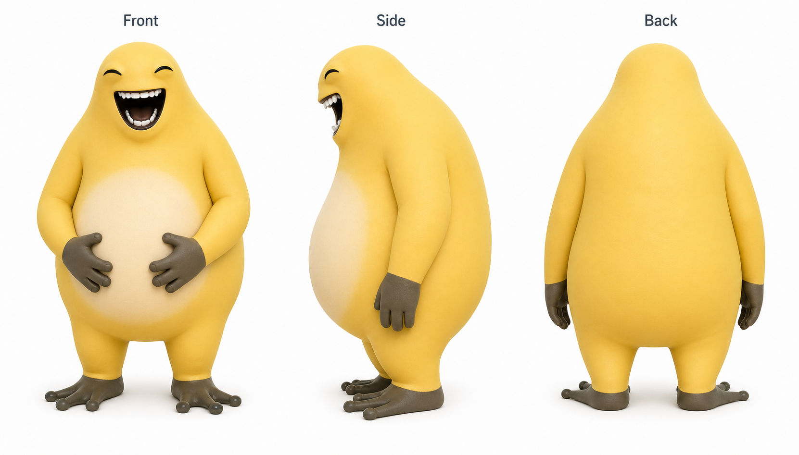
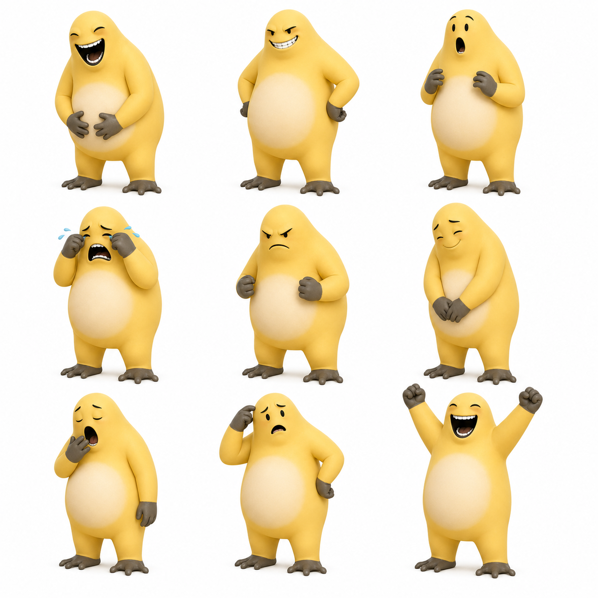

# 捧腹奶龙角色设计初稿

## 定位

捧腹奶龙是一个以“表情姿态”为核心的新角色。

角色气质偏喜剧、情绪外放、身体很耐打。战斗中不追求稳定切换姿态，而是通过带一点随机性的表情变化，制造临场取舍。

## 视觉参考

视觉关键词：

- 黄色软胖体型，腹部是最重要的视觉中心。
- 表情夸张，适合承载表情姿态机制。
- 动作气质偏搞笑、外放、反差感强。
- 灰色手脚可以作为卡面、图标和 UI 边框的辅助色。

素材说明：

- 当前图片作为角色设计参考图归档。
- 进入正式发布前，需要确认图片授权和最终游戏资源形态。
- 后续游戏内资源应从参考图拆分或重绘为角色立绘、表情图标、卡牌插画和动画素材。

设计目标：

- 让角色形象和机制一致：大笑、惊吓、委屈、生气等表情都能影响战斗。
- 每个表情都同时有正面和负面效果，避免成为纯收益姿态。
- 起始版本只开放少量表情，降低学习成本。
- 先保证规则简单，后续再扩展更多表情和进阶遗物。

## 核心机制：表情

表情是捧腹奶龙的专属姿态系统。

基础规则：

- 同一时间只能处于一种表情。
- 进入新表情会覆盖当前表情。
- 表情会持续，直到被其他表情替换。
- 每个表情都有一个正面效果和一个负面效果。
- 部分卡牌会随机进入表情，体现捧腹奶龙情绪不稳定的特征。

## 初始表情

v0.1 先只实现两个表情。

| 表情 | 正面效果 | 负面效果 |
| --- | --- | --- |
| 大笑 | 攻击牌额外造成 2 点伤害 | 技能牌获得的格挡减少 2 |
| 惊吓 | 技能牌额外获得 3 点格挡 | 攻击牌造成的伤害减少 2 |

设计说明：

- 大笑是进攻姿态，但会削弱防御。
- 惊吓是防御姿态，但会削弱输出。
- 起始机制牌随机进入大笑或惊吓，玩家需要根据结果调整本回合打法。

## 初始遗物

### 奶龙肚肚

类型：初始遗物

效果：

> 每回合第一次进入表情时，获得 3 点格挡。

设计说明：

- 奖励玩家使用表情机制。
- 每回合只触发一次，避免反复切换表情堆出过高格挡。
- 与“肚肚”形象一致，提供稳定但不过量的防御收益。

## 起始牌组

| 卡牌 | 数量 | 类型 | 费用 | 效果 |
| --- | ---: | --- | ---: | --- |
| 奶龙拍击 | 5 | 攻击 | 1 | 造成 6 点伤害。 |
| 奶龙抱肚 | 4 | 技能 | 1 | 获得 5 点格挡。 |
| 情绪失控 | 1 | 技能 | 1 | 随机进入大笑或惊吓。获得 3 点格挡。 |

## 起始体验

捧腹奶龙开局不是稳定姿态角色，而是“用随机表情制造波动，再根据结果调整出牌”。

典型回合：

- 打出情绪失控，随机进入大笑或惊吓。
- 如果进入大笑，本回合更适合打攻击牌。
- 如果进入惊吓，本回合更适合打防御牌。
- 如果这是本回合第一次进入表情，奶龙肚肚额外提供 3 点格挡。

## 后续待设计

后续表情暂不进入 v0.1，等基础卡池稳定后再扩展：

| 表情 | 候选定位 |
| --- | --- |
| 生气 | 更强攻击和压制，但降低抽牌或防御稳定性 |
| 得意 | 抽牌和节奏，但提高受伤风险 |
| 委屈 | 保命和恢复，但降低攻击效率 |

后续还需要设计：

- Common 卡 8 到 10 张。
- Uncommon / Rare 卡的表情利用方式。
- 进阶遗物。
- 表情图标和 UI 表现。
- 表情实现方式：Power、角色状态字段，或专属状态管理模块。

## 当前结论

当前定稿范围：

- 角色名：捧腹奶龙。
- 核心机制：表情姿态。
- v0.1 表情：大笑、惊吓。
- 初始遗物：奶龙肚肚。
- 起始牌组：奶龙拍击 5、奶龙抱肚 4、情绪失控 1。

当前不定稿范围：

- 完整卡池。
- 进阶遗物。
- 其他表情的最终数值。
- 角色资源和动画实现细节。
